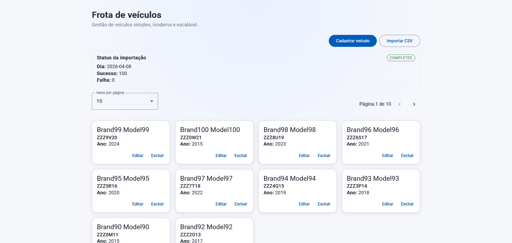
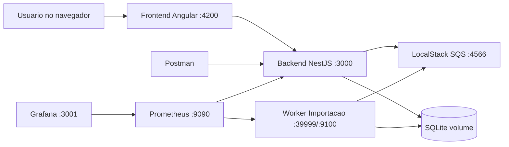
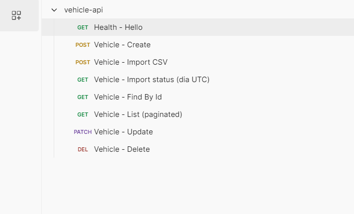
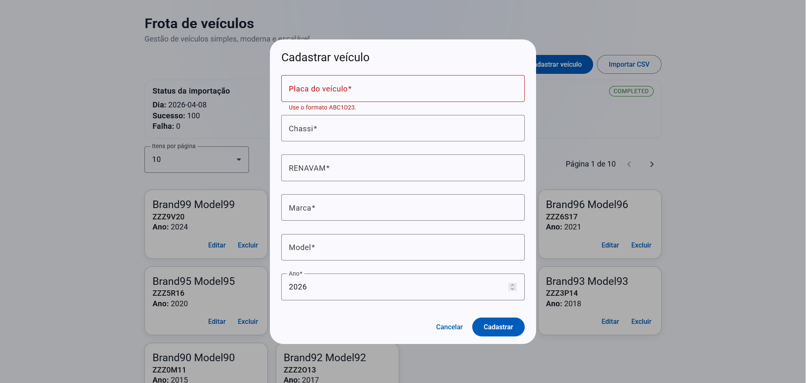
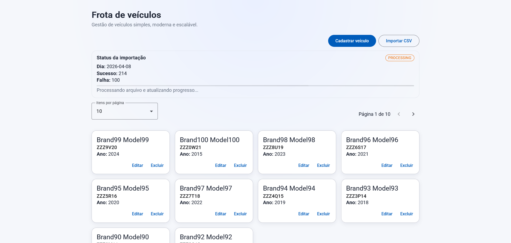
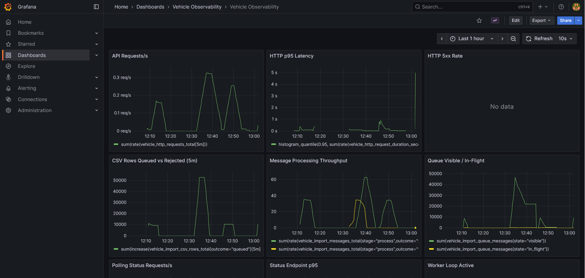
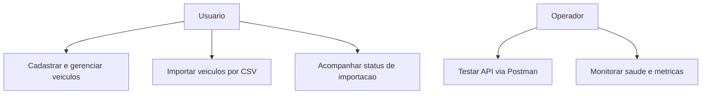
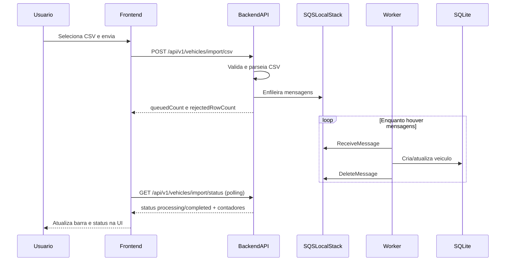
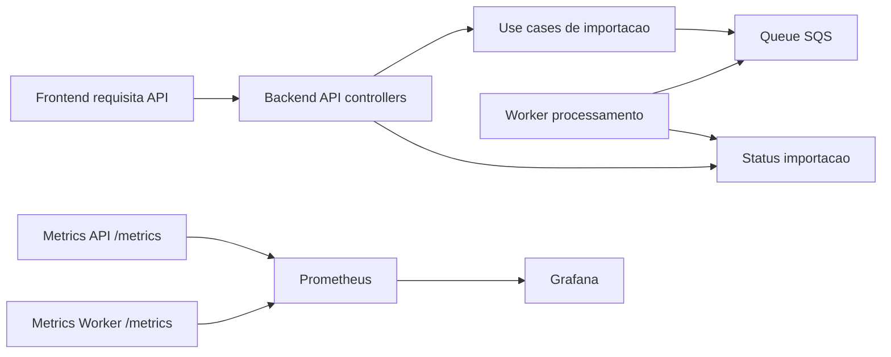

# Documentacao Completa do Projeto

Guia principal para executar, testar e monitorar o sistema **test-feedz**.

## Indice

- [1. Visao geral](#1-visao-geral)
- [2. Arquitetura em containers](#2-arquitetura-em-containers)
- [3. Pre-requisitos](#3-pre-requisitos)
- [4. Como rodar com Docker (passo a passo)](#4-como-rodar-com-docker-passo-a-passo)
- [5. Testando somente o backend com Postman](#5-testando-somente-o-backend-com-postman)
- [6. Fluxo de importacao CSV](#6-fluxo-de-importacao-csv)
- [7. Frontend no navegador](#7-frontend-no-navegador)
- [8. Monitoramento com Prometheus e Grafana](#8-monitoramento-com-prometheus-e-grafana)
- [9. Diagramas de caso de uso e fluxo completo](#9-diagramas-de-caso-de-uso-e-fluxo-completo)
- [10. Troubleshooting rapido](#10-troubleshooting-rapido)

## 1. Visao geral

O projeto possui os seguintes componentes:

- `frontend` (Angular): interface para cadastrar, listar e importar veiculos.
- `backend` (NestJS): API HTTP para CRUD, upload CSV e status de importacao.
- `backend-worker`: consumidor de fila para processar importacao assincrona.
- `localstack`: emulacao do SQS para fila de importacao.
- `prometheus`: coleta de metricas da API e do worker.
- `grafana`: dashboard para observabilidade.

Print da tela principal da aplicacao:



## 2. Arquitetura em containers



## 3. Pre-requisitos

- Docker Desktop instalado e em execucao.
- Docker Compose habilitado (`docker compose`).
- Portas livres: `3000`, `39999`, `4200`, `4566`, `9090`, `9100`, `3001`.

## 4. Como rodar com Docker (passo a passo)

Referencia oficial dos comandos: [`DOCKER-COMMANDS.md`](DOCKER-COMMANDS.md).

1) Build das imagens:

```bash
docker compose build
```

2) Copiar arquivo de ambiente do backend:

```bash
copy backend\.env.example backend\.env
```

3) Subir todos os servicos:

```bash
docker compose up -d
```

4) Conferir estado dos containers:

```bash
docker compose ps
```

5) Conferir logs (se necessario):

```bash
docker compose logs -f backend
docker compose logs -f backend-worker
docker compose logs -f localstack
```

6) Smoke tests rapidos:

```bash
curl http://localhost:3000/api/v1
curl http://localhost:3000/metrics
curl http://localhost:9100/metrics
```

### URLs apos subir

- Frontend: `http://localhost:4200`
- Backend API base: `http://localhost:3000/api/v1`
- Health: `http://localhost:3000/`
- Metricas API: `http://localhost:3000/metrics`
- Metricas Worker: `http://localhost:9100/metrics`
- Prometheus: `http://localhost:9090`
- Grafana: `http://localhost:3001`

Para parar tudo:

```bash
docker compose down
```

## 5. Testando somente o backend com Postman

Collection oficial:

- [`backend/docs/vehicle-api.postman_collection.json`](backend/docs/vehicle-api.postman_collection.json)

Print da collection:



### Passo a passo sugerido

1) Importe a collection no Postman.
2) Garanta a variavel `baseUrl` com valor:
   - `http://localhost:3000/api/v1`
3) Execute as rotas nesta ordem:
   - `Health - Hello`
   - `Vehicle - Create`
   - `Vehicle - List (paginated)`
   - `Vehicle - Find By Id`
   - `Vehicle - Update`
   - `Vehicle - Import CSV`
   - `Vehicle - Import status (dia UTC)`
   - `Vehicle - Delete`

Observacoes:

- A rota de importacao usa multipart/form-data com campo `file`.
- A rota de status retorna `idle`, `processing` ou `completed`.
- A collection salva `vehicleId` automaticamente apos o create.

## 6. Fluxo de importacao CSV

Arquivos CSV de referencia para testes:

- [`backend/docs/samples/vehicles-import-100.csv`](backend/docs/samples/vehicles-import-100.csv)
- [`backend/docs/samples/vehicles-import-10000.csv`](backend/docs/samples/vehicles-import-10000.csv)

Fluxo operacional:

1) Selecionar CSV no frontend ou usar rota `POST /vehicles/import/csv` no Postman.
2) Backend valida e enfileira mensagens no SQS (LocalStack).
3) Worker consome fila e processa linha a linha.
4) Frontend consulta `GET /vehicles/import/status` em polling.
5) Quando finalizar, status muda para `completed`.

Print do formulario:



Print durante processamento:



Print com status final:


## 7. Frontend no navegador

Depois do `docker compose up -d`, abra:

- `http://localhost:4200`

No frontend voce consegue:

- cadastrar veiculo;
- listar paginado;
- editar/excluir;
- importar CSV;
- acompanhar progresso de importacao na tela.

## 8. Monitoramento com Prometheus e Grafana

### Prometheus

- URL: `http://localhost:9090`
- Autenticacao: sem login por padrao no compose atual.

### Grafana

- URL: `http://localhost:3001`
- Usuario: `admin`
- Senha: `admin`

Print do dashboard:



Metricas uteis para acompanhar:

- Requests por segundo da API.
- Latencia HTTP p95.
- Taxa de erro HTTP 5xx.
- Throughput de processamento de mensagens.
- Fila SQS visivel e in-flight.

## 9. Diagramas de caso de uso e fluxo completo

### 9.1 Caso de uso (alto nivel)



### 9.2 Sequencia da importacao CSV



### 9.3 Fluxo backend + observabilidade



## 10. Troubleshooting rapido

- **Porta ocupada**: rode `docker compose ps` e libere portas em conflito.
- **API fora do ar**: verifique `docker compose logs -f backend`.
- **Worker sem processar**: verifique `docker compose logs -f backend-worker` e `localstack`.
- **Dashboard sem dados**: confira targets no Prometheus (`http://localhost:9090`) e endpoint `/metrics`.
- **CSV rejeitado**: valide cabecalho e formato dos campos (placa, chassi, renavam, marca, modelo, ano).

Comandos de apoio:

```bash
docker compose ps
docker compose logs -f backend
docker compose logs -f backend-worker
docker compose logs -f localstack
curl http://localhost:3000/metrics
curl http://localhost:9100/metrics
```

## Referencias adicionais

- [`DOCKER-COMMANDS.md`](DOCKER-COMMANDS.md)
- [`docker-compose.yml`](docker-compose.yml)
- [`backend/docs/architecture.md`](backend/docs/architecture.md)
- [`backend/docs/uml-veiculo.md`](backend/docs/uml-veiculo.md)
- [`frontend/README.md`](frontend/README.md)

Documentos auxiliares:

- [Comandos Docker](DOCKER-COMMANDS.md)
- [Backend README](backend/README.md)
- [Frontend README](frontend/README.md)
