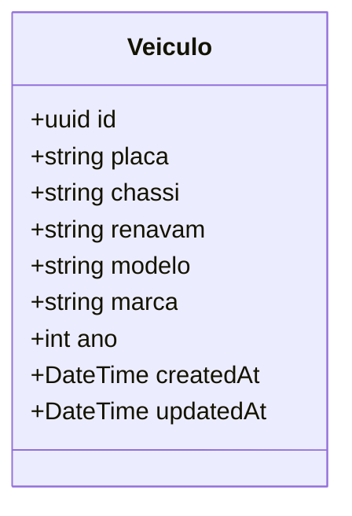
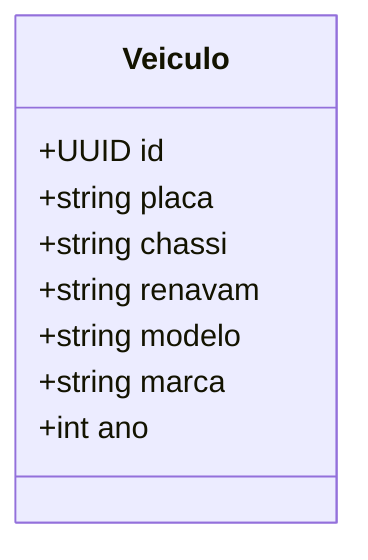

# UML da tabela Veiculo

## Regras de negocio

- `placa` deve ser unica.
- `chassi` deve ser unico.
- `renavam` deve ser unico.
- `ano` deve ser inteiro e estar entre `1900` e `2100`.
- A tabela e representada no modelo `Veiculo` em `prisma/schema.prisma`.
# UML - Entidade Veiculo

Este diagrama representa a modelagem inicial da tabela `veiculos` no backend.

## Regras de modelagem recomendadas

- `id` como chave primaria (UUID).
- `placa` com restricao de unicidade.
- `chassi` com restricao de unicidade.
- `renavam` com restricao de unicidade.
- `ano` com validacao de faixa (exemplo: `>= 1900` e `<= anoAtual + 1`).
