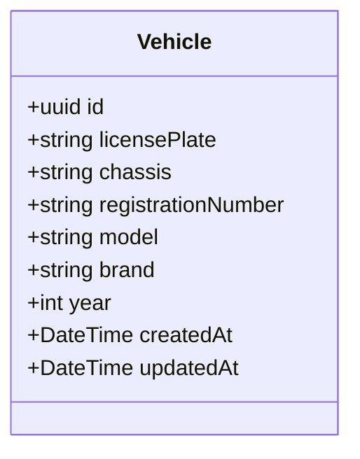

# Vehicle UML

## Business rules

- `licensePlate` must be unique.
- `chassis` must be unique.
- `registrationNumber` must be unique.
- `year` must be an integer between `1900` and `2100`.
- The table is represented by the `Vehicle` model in `prisma/schema.prisma`.

## Author

- Name: Jerfson Silva dos Santos
- LinkedIn: https://www.linkedin.com/in/jerfson-silva/
- Website: http://jerfsonsilva.com/
